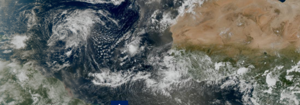

# Introduction To Tropical Meteorology

This course examines the physical and dynamical processes governing the tropical atmosphere. Emphasis is placed on connecting fundamental theory—including energy balances, moist thermodynamics, vorticity dynamics, wave dynamics, and atmosphere–ocean coupling—to observations of tropical circulations and weather systems.

Major topics include radiative–convective equilibrium, the Hadley circulation, equatorial waves, the Madden–Julian oscillation, tropical synoptic-scale disturbances, monsoons, tropical cyclones, and the El Niño–Southern Oscillation.

Students will develop theoretical understanding, quantitative problem-solving skills, and experience analyzing satellite, reanalysis, and tropical cyclone datasets.

## Getting Started
